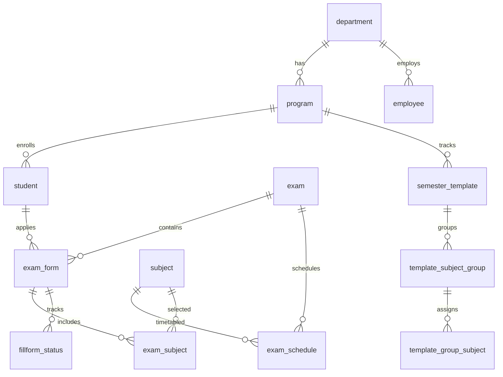

# 🎓 EAS – Examination Application System

An enterprise-grade, full-stack **Online Examination Processing & Management System** built with **PostgreSQL + Express.js + React (Vite)** designed for autonomous engineering institutions (TCET Mumbai format).

---

## 📑 Table of Contents
- [Architecture & Tech Stack](#-architecture--tech-stack)
- [Project Directory Structure](#-project-directory-structure)
- [Key Features](#-key-features)
  - [Student Portal](#1-student-portal)
  - [Administration & Examination Cell Console](#2-administration--examination-cell-console)
- [Security & Architecture Highlights](#-security--architecture-highlights)
- [Setup & Installation](#-setup--installation)
- [Environment Configuration (`.env`)](#-environment-configuration-env)
- [Demo Credentials](#-demo-credentials)
- [Database Schema](#-database-schema)
- [REST API Endpoints](#-rest-api-endpoints)

---

## 🛠 Architecture & Tech Stack

| Layer | Technology |
|---|---|
| **Frontend** | React 18, Vite, React Router v6, Axios, Lucide Icons, Vanilla CSS Design System |
| **Backend** | Node.js, Express.js (Modular Feature-Driven Architecture), Helmet, Rate-Limiters |
| **Database** | PostgreSQL with Connection Pooling (`pg`), Transactional Integrity |
| **Media & Storage** | Cloudinary (lightweight relative path storage architecture, strict 100 KB limit) |
| **Payments** | Razorpay Payment Gateway (Order creation, HMAC-SHA256 signature verification) |
| **PDF Engine** | PDFKit (Official 2-Page TCET Examination Form & Admission Card Generation) |

---

## 🗂 Project Directory Structure

```
EAS/
├── db/
│   ├── schema.sql                                ← Complete DDL database schema
│   └── seed.sql                                  ← Seed records (departments, programs, subjects, demo users)
├── backend/                                      ← Express.js REST API (Port 5000)
│   ├── src/
│   │   ├── core/
│   │   │   ├── config/ (db.js, razorpay.js, cloudinary.js)
│   │   │   ├── middleware/ (auth.js, rbac.js, rateLimiter.js)
│   │   │   └── utils/ (pdfService.js)
│   │   ├── features/                             ← Feature-Driven Modules
│   │   │   ├── auth/                             ← JWT login, registration, session management
│   │   │   ├── student/                          ← Student profile & completeness gating
│   │   │   ├── exam/                             ← Exam listings, eligibility & hold checks
│   │   │   ├── subject/                          ← Subject master repository & lookups
│   │   │   ├── form/                             ← Exam form lifecycle, Razorpay & PDF downloads
│   │   │   ├── program/                          ← Academic departments & programs
│   │   │   └── admin/                            ← Employee management & Semester Templates
│   │   ├── routes/admin.js                       ← Form approvals, admit cards, schedule health
│   │   └── server.js                             ← App entry point & security middleware
│   └── .env                                      ← DB, JWT, Razorpay & Cloudinary credentials
└── frontend/                                     ← React + Vite Web App (Port 5173 / 5174)
    └── src/
        ├── assets/ (index.css, tcetlogo.png)     ← Premium Navy & Gold theme design system
        ├── components/ (Logos.jsx, LookupSelect)
        ├── context/AuthContext.jsx               ← User auth & role state
        ├── features/
        │   ├── auth/pages/LoginPage.jsx
        │   ├── student/pages/                    ← Dashboard, ExamFormPage, ProfilePage, PaymentPage
        │   └── admin/pages/                      ← AdminDashboard, ApproveForm, AdmitCardManage,
        │                                            ScheduleExam, CreateExam, CreateSubject,
        │                                            SemesterTemplateManagement, EmployeeManagement,
        │                                            FailedRecordsManagement, HoldListManagement
        ├── layouts/Layout.jsx                    ← Header, navigation, profile pill & footer
        ├── router/index.jsx                      ← Protected RBAC client routes
        └── utils/imageUtils.js                   ← Cloudinary URL resolver & 100 KB validator
```

---

## ✨ Key Features

### 1. Student Portal
- **Dashboard Overview**: View active regular, ATKT, and supplementary exams with real-time status badges (Open, Pending Payment, Applied, Approved, Admit Card Released).
- **Student Profile & Cloudinary Photo Storage**:
  - Displays circular avatar resolving Cloudinary paths.
  - Image uploader enforces a strict **maximum file size of 100 KB**.
  - PostgreSQL stores only the 30-character relative path (e.g. `v1789934033/eas_students/stu_1.jpg`).
- **Profile Completeness Enforcement Gate**:
  - Prevents students from filling or submitting exam forms if mandatory profile details (Name, Mother Name, 10-digit Contact, Address, 12-digit ABC ID, Photo) are incomplete.
  - Features an informative alert modal with a direct checklist link to complete their profile.
- **Dynamic Curriculum Tracks (Semester Templates)**:
  - Select pre-defined academic tracks created by department coordinators with automatic elective slot selection.
  - Includes full manual selection mode with search filters.
- **Eligibility & Hold Enforcement**:
  - Blocks ATKT/Supplementary registration if the student is not registered in prerequisite failed lists.
  - Blocks students with active Counter No. 8 hold restrictions.
- **Fee Calculation & Razorpay Integration**:
  - Automatically calculates late fee slabs based on deadlines.
  - Complete payment via Razorpay checkout with instantaneous receipt verification.
- **Official PDF Generation**:
  - Download official 2-Page TCET Examination Application Form with vector checkmarks and payment receipts.
  - Download official Admission Card (Hall Ticket) with candidate photo, seat number, and scheduled timetable.

### 2. Administration & Examination Cell Console
- **Multi-Tiered RBAC**: Granular permissions across `HEAD`, `ADMIN`, and `COORDINATOR` roles.
- **Dynamic Exam Code Builder**:
  - Helper dropdowns for Exam Type (`REG`/`SUPP`/`ATKT`), Semester (`ODD`/`EVEN`), and Year (`2026`) that auto-construct standardized codes (e.g., `REG-ODD-2026`) while remaining 100% manually editable.
- **Curriculum Track & Template Builder**:
  - Create track templates per department semester, grouping subjects into mandatory courses and elective buckets.
- **Schedule Exam Master**:
  - Allocate exam dates, start/end times, and junior supervisor signature columns.
- **Form Approval & Schedule Health Check**:
  - **Schedule Health Check**: Inspects all subjects chosen by applicants. If any subject lacks an exam timetable, it displays the missing subject codes (comma-separated) for quick copy-pasting into the schedule search bar.
- **Admit Card Release Safety Gate**:
  - Blocks releasing admit cards until 100% of enrolled subjects for that exam have confirmed schedules.
  - Generates official randomized seat numbers on release.
- **Failed Records & Hold List Management**:
  - Bulk add student failed records for ATKT/supplementary eligibility.
  - Place or lift Counter No. 8 administrative holds with custom reason codes.
- **Count Analysis & Analytics**:
  - Real-time departmental statistics and enrollment distribution charts.

---

## 🔒 Security & Architecture Highlights

- **HTTP Security Headers**: Powered by `helmet` with secure cross-origin resource policies.
- **Tiered Rate Limiting**:
  - `authLimiter`: 10 attempts per 15-minute window for auth endpoints.
  - `apiGlobalLimiter`: 500 requests per 15-minute window for general API operations.
  - `sessionVerifyLimiter`: 120 heartbeat requests per minute.
- **Database-Backed Session Revocation**: Invalidates JWT tokens upon sign-out.
- **Payment Signature Verification**: Validates Razorpay HMAC-SHA256 signatures server-side before confirming payment.

---

## 🚀 Setup & Installation

### 1. Clone & Install Dependencies

```bash
# Clone the repository
git clone https://github.com/gkaranh09/EAS.git
cd EAS

# Install Backend dependencies
cd backend
npm install

# Install Frontend dependencies
cd ../frontend
npm install
```

### 2. Database Setup

```bash
# Connect to PostgreSQL and create database
psql -U postgres -c "CREATE DATABASE eas_db;"

# Run DDL Schema & Seed Data
psql -U postgres -d eas_db -f db/schema.sql
psql -U postgres -d eas_db -f db/seed.sql
```

### 3. Start Development Servers

```bash
# Terminal 1: Start Backend (Port 5000)
cd backend
npm run dev

# Terminal 2: Start Frontend (Port 5173 / 5174)
cd frontend
npm run dev
```

---

## ⚙️ Environment Configuration (`.env`)

Create or update `backend/.env` with your credentials:

```env
PORT=5000
DB_HOST=localhost
DB_PORT=5432
DB_NAME=eas_db
DB_USER=postgres
DB_PASSWORD=your_postgres_password
JWT_SECRET=eas_super_secret_jwt_key_change_in_production_2026
JWT_EXPIRES_IN=7d

# Razorpay Credentials (from Razorpay Dashboard)
RAZORPAY_KEY_ID=rzp_test_your_key_id
RAZORPAY_KEY_SECRET=your_key_secret

# Cloudinary Storage Credentials (from Cloudinary Dashboard)
CLOUDINARY_CLOUD_NAME=dvix6mmnt
CLOUDINARY_API_KEY=your_cloudinary_api_key
CLOUDINARY_API_SECRET=your_cloudinary_api_secret
```

---

## 🔐 Demo Credentials

### Faculty & Administrative Accounts
| Role | Email | Password |
|---|---|---|
| **Head (Exam Controller)** | `head@tcetmumbai.in` | `password123` |
| **Admin (Exam Cell)** | `admin@tcetmumbai.in` | `password123` |
| **Coordinator (COMP)** | `coordinator@tcetmumbai.in` | `password123` |

### Student Accounts
| Student Name | Email | Password | Year / Sem |
|---|---|---|---|
| Karan Sharma | `9579823812@tcetmumbai.in` | `password123` | Year 2 (Sem 3) |
| Priya Mehata | `9876543210@tcetmumbai.in` | `password123` | Year 2 (Sem 3) |
| Ravish Kulkarni | `9123456789@tcetmumbai.in` | `password123` | Year 3 (Sem 5) |

---

## 🗄 Database Schema



---

## 📡 REST API Endpoints Summary

### Authentication (`/api/auth`)
- `POST /api/auth/login` – Student Login
- `POST /api/auth/register` – Student Registration
- `POST /api/auth/employee/login` – Faculty/Admin Login
- `POST /api/auth/logout` – Revoke session token
- `GET /api/auth/session/verify` – Session verification heartbeat

### Student & Profile (`/api/student`)
- `GET /api/student/me` – Current student profile
- `GET /api/student/profile-status` – Completeness check (missing fields)
- `PUT /api/student/profile` – Update profile details
- `POST /api/student/upload-photo` – Upload photo to Cloudinary (≤ 100 KB)

### Exam Application & Forms (`/api/form`, `/api/exams`)
- `GET /api/exams` – List active exams with apply status
- `POST /api/form/submit` – Submit exam form (profile & eligibility gated)
- `GET /api/form/status` – Get submitted forms status
- `POST /api/form/create-order` – Create Razorpay order
- `POST /api/form/verify-payment` – Verify payment & update status
- `GET /api/form/pdf/:formId` – Download official TCET exam form PDF
- `GET /api/form/admit-card/pdf/:formId` – Download official admit card PDF

### Admin & Examination Cell (`/api/admin`)
- `GET /api/admin/services/form_approvals` – List student forms for approval
- `POST /api/admin/action/approve_forms` – Approve selected exam forms
- `GET /api/admin/action/admit_card_overview` – Admit card release overview
- `POST /api/admin/action/release_admit_cards` – Release admit cards & generate seat numbers
- `GET /api/admin/schedule-health/:examId` – Verify timetable completeness before release
- `GET /api/admin/services/count_analysis` – Real-time application statistics
- `GET/POST /api/admin/semester-templates` – Manage department track templates
- `GET/POST /api/admin/employees` – Manage faculty & coordinators

---

## 📄 License
Designed and developed for **Thakur College of Engineering & Technology (TCET)** Examination Application System. All rights reserved.
